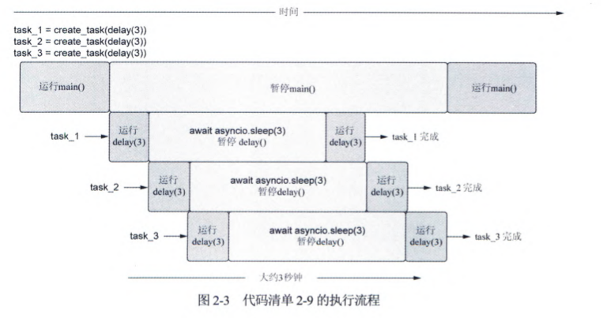
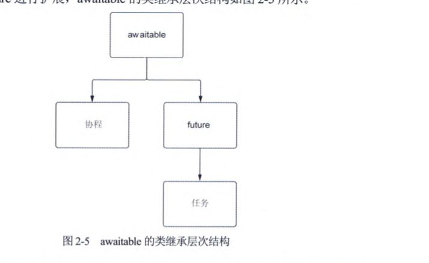

[TOC]


```markmap
---
markmap:
  zoom: false
  pan: false
  height: 300px
  backgroundColor: "#f8f8f8"
---

# 关于协程
## 创建协程
## 比较普通函数
## 执行协程
## await 关键字暂停执行
## 使用sleep
## 运行两个协程
# 通过任务并行
## ch
```

# 关于协程

可将协程想象成一个普通的Python函数，但它具有在遇到可能需要一段时间才能
完成的操作时，暂停执行的超能力
## 创建协程
使用`async`将函数标记为协程
```python
async def my_coroutine()->None:
    print("hello world")
```
##  比较普通函数
```python
async def coroutine_add_one(number:int)->int:
    return number+1
def add_one(number:int)->int:
    return number+1
res=add_one(1)
coro_res=coroutine_add_one(res)
print(res)
print(coro_res)
async def coroutine_add_one(number:int)->int:
    return number+1
def add_one(number:int)->int:
    return number+1
res=add_one(1)
coro_res=coroutine_add_one(res)
print(res)
print(coro_res)
"""
2
<coroutine object coroutine_add_one at 0x0000015A26265B40>
<sys>:0: RuntimeWarning: coroutine 'coroutine_add_one' was never awaited
"""
```
可以发现协程没有执行，返回一个协程对象
## 执行协程
```python
import asyncio
async def coroutine_add_one(number:int)->int:
    return number+1

if __name__ == '__main__':
    res=asyncio.run(coroutine_add_one(10))
    print(res)
import asyncio
async def coroutine_add_one(number:int)->int:
    return number+1

if __name__ == '__main__':
    res=asyncio.run(coroutine_add_one(10))
    print(res)
"""
11
"""
```
`asyncio.run` 首先创建了一个全新的事件。
一旦创建成功，就会接受传递给它的任何协程，运行直到完成，关闭，结束事件循环
## await 关键字暂停执行
```python
import asyncio
async def coroutine_add_one(number:int)->int:
    return number+1

async def main():
    one=await coroutine_add_one(1)
    two=await coroutine_add_one(2)
    print(one)
    print(two)
if __name__ == '__main__':
    asyncio.run(main())
"""
2
3
"""
```
`await`关键字之后会调用其他协程（更具体第说，是一个被称为awaitable对象 它并不总是协程)
`await`关键字会使用后面的协程运行，直接调用协程会返回一个协程对象。
## 使用sleep
```python
import asyncio
async def hello_world()->str:
    await asyncio.sleep(1)
    return 'hello world'

async def main()->None:
    message=await hello_world()
    print(message)
if __name__ == '__main__':
    asyncio.run(main())
```
await 等待hello_world的执行，等1秒。
## 运行两个协程
```python
import asyncio
from util import delay
async def add_one(number:int)->int:
    return number + 1
async def hello_world()->str:
    await delay(1)
    return 'hello world'
async def main():
    message=await hello_world()
    one=await add_one(1)
    print(message)
    print(one)
if __name__ == '__main__':
    asyncio.run(main())
"""
睡1秒
结束睡眠1秒
hello world
2
"""
```
可以发现两个协程是串行的，而不是并行的
`sleep`的时候，`main`和`hello_world`都暂停了。
不是并行的
# 通过任务并行
​    任务是协程的包装器，它安排协程尽快在事件循环上运行。这种调度和执行以非
阻塞方式发生，这意味着一旦创建一个任务，就可以在任务运行时立即执行其他代码。
这与使用阻塞方式的await关键字形成对比，意味着暂停整个协程，直到await表达式
的结果返回。  
​    可创建任务并安排它们在事件循环上立即运行，这意味着可以大致同时执行多个
任务。当这些任务包装一个长时间运行的操作时，它们所做的任何等待都将同时发生。
为说明这一点，下面创建两个任务并尝试同时运行它们。

## 创建任务
​     创建任务是通过`asyncio.create_task`函数来实现的。当调用这个函数时，给它一个
协程来运行，它会立即返回一个任务对象。一旦有了一个任务对象，就可以把它放在
一个await表达式中，它完成后就会提取返回值。
```python
import asyncio
from util import delay
async def main():
    sleep_three=asyncio.create_task(delay(3))
    print(type(sleep_three))
    result = await sleep_three
    print(result)
if __name__ == '__main__':
    asyncio.run(main())
"""
<class '_asyncio.Task'>
睡3秒
结束睡眠3秒
3
"""
```
类型是`<class '_asyncio.Task'>` 表明于协程不同。
使用 ·asyncio.create_task· 创建任务时，协程会被立即调度在事件循环中开始执行（即进入就绪状态），但不会阻塞当前协程。
任务会在事件循环空闲时自动运行，无需手动启动。
`await` 应用于任务，这将暂停主协程，直到从任务中得到结果

## 同时运行多个任务
```python
import asyncio
from util import delay
async def main():
    sleep_for_three=asyncio.create_task(delay(3))
    sleep_for_again=asyncio.create_task(delay(3))
    sleep_for_once_more=asyncio.create_task(delay(3))
    print("______________")
    await sleep_for_three
    await sleep_for_again
    await sleep_for_once_more

if __name__ == '__main__':
    asyncio.run(main())

```
启动了三个任务，每个任务需要3秒，并将同时执行所有的休眠操作。
程序将在三秒左右完成。运行如下

## 等待中执行其他代码
```python
import asyncio
from util import delay
async def hello_every_second():
    for i in range(2):
        await asyncio.sleep(1)
        print("I'm running other code while I'm waiting!")

async def main():
    first_delay=asyncio.create_task(delay(3))
    second_delay=asyncio.create_task(delay(3))
    await hello_every_second()
    await first_delay
    await second_delay

if __name__ == '__main__':
    asyncio.run(main())
"""
睡3秒
睡3秒
I'm running other code while I'm waiting!
I'm running other code while I'm waiting!
结束睡眠3秒
结束睡眠3秒
"""
```
首先启动两个任务，每个任务休眠3秒。然后，当两个任务空闲时，可以看到没秒都输出了
"I'm running other code while I'm waiting!",意味着。即使在运行时间密集型 操作时，应用程序可以执行其他任务。
#  取消任务与设置超时
## 取消任务
取消任务很简单，每个任务对象都有一个名为 `cancel`的方法。
取消任务将导致改任务在执行`await`时抛出`CancelledError`异常。
```python
import asyncio
from asyncio import CancelledError
from util import delay
async def main():
    long_task=asyncio.create_task(delay(10))
    seconds_elapsed=0
    while not long_task.done():
        print("任务还在运行")
        await asyncio.sleep(1)
        seconds_elapsed+=1
        if seconds_elapsed==5:
            long_task.cancel()
    try:
        await long_task
    except CancelledError:
        print("任务被取消了")

if __name__ == '__main__':
    asyncio.run(main())
```
创建了10秒的任务，等待5秒后取消它
`CancelledError`只能从`await`语句中捕获
##  设置超时并使用`wait_for`执行取消
```python
import asyncio
from asyncio import CancelledError
from util import delay
async def main():
    long_task=asyncio.create_task(delay(10))
    try:
        result=await asyncio.wait_for(long_task,timeout=4)
        print(result)
    except asyncio.TimeoutError:
        print("任务超时")

if __name__ == '__main__':
    asyncio.run(main())
"""
睡10秒
任务超时
"""
```
任务超时被取消，可以不取消任务
## 保户任务不被取消
```python
import asyncio
from asyncio import CancelledError
from util import delay
async def main():
    long_task=asyncio.create_task(delay(10))
    try:
        result=await asyncio.wait_for(asyncio.shield(long_task),timeout=4)
        print(result)
    except asyncio.TimeoutError:
        print("任务超时")
        result=await long_task
        print(result)
        

if __name__ == '__main__':
    asyncio.run(main())
```
`asyncio.shield` 保护任务不被取消
# 任务、协程、future和awaitable
 任务和协程都可以在await表达式中使用，那么它们之间的共同点是什么？要理
解这一点，我们需要了解`future`和`awaitable`。
## 关于future
future是一个Python对象，它包含一个你希望在未来某个时间点获得但目前可能
还不存在的值。
### 创建future
```python
from asyncio import Future,run
async def main():
    my_future = Future()
    print(f"future done: {my_future.done()}")
    my_future.set_result("hello")
    print(f"future done: {my_future.done()}")
    print(f"future result: {my_future.result()}")
if __name__ == '__main__':
    run(main())
"""
future done: False
future done: True
future result: hello
"""
```
可以调用其构造函数创建一个future对象，此时，future没有结果
调用`done`方法返回`False`，表示future没有完成
调用`set_result`方法设置结果，future完成
future也可以用在await表达式中，如果对一个future使用await表达式，
表示执行“暂停”，直到future有一个可使用的结果，一旦有了结果，唤醒，处理
### 等待future
```python
from asyncio import Future
import asyncio


async def set_future_value(future):
    await asyncio.sleep(1)
    future.set_result("hello")


def make_request()->Future:
    future=Future()
    asyncio.create_task(set_future_value(future))
    return future

async def main():
    future=make_request()
    print(f"future done: {future.done()}")
    result=await future
    print(f"future done: {future.done()}")
    print(f"future result: {result}")

if __name__ == '__main__':
    asyncio.run(main())
```
## future、任务和协程之间的关系
任务直接继承自future。future可以
被认为代表了我们暂时不会拥有的值。一个任务可以被认为是一个协程和一个future
的组合。创建一个任务时，我们正在创建一个空future，并运行协程。然后，当协程
以得到结果或异常结束时，我们将设置future的结果或异常
它们之间的共同点是awaitable抽象基类。这个类定义了一个抽象的双下画线方法
__await__。 任何实现__await__方法的东西都可以在await表达式中使用。
类继承关系如下

 将可在await表达式中使用的对象称为awaitable对象

# 使用装饰器测量协程执行时间


## 协程计时装饰器

```python
import functools
import time
from typing import Callable,Any
def async_timed():
    """
    装饰器，用于测量异步函数的执行时间。
    参数:
        func: 要装饰的异步函数。
    返回:
        包装后的异步函数，执行时会打印开始和结束时间以及耗时。
    """
    def wrapper(func: Callable[..., Any]) -> Callable[..., Any]:
        @functools.wraps(func)
        async def wrapped(*args, **kwargs) -> Any:
            print(f'strarting {func} with args: {args}, kwargs: {kwargs}')
            start_time = time.time()
            try:
                return await func(*args, **kwargs)
            finally:
                end_time = time.time()
                elapsed_time = end_time - start_time
                print(f'finished {func} in {elapsed_time:.2f} seconds')
        return wrapped
    return wrapper
```

`Callable[..., Any] `表示“可以被调用的对象”，也就是函数、方法或实现了 __call__ 方法的对象。

`...` 表示参数不限（可以有任意数量和类型的参数）。
	`Any `表示返回值类型不限。
	所以，`Callable[..., Any] `用于类型注解，表示“任意参数、任意返回值的可调用对象”。

使用

```python
import asyncio
from util import async_timed
@async_timed()
async def delay(delay_seconds:int)->int:
    print(f'sleeping for {delay_seconds} seconds')
    await asyncio.sleep(delay_seconds)
    print(f'finished sleeping for {delay_seconds} seconds')
    return delay_seconds
@async_timed()
async def main():
    task1 = asyncio.create_task(delay(2))
    task2 = asyncio.create_task(delay(3))
    await task1
    await task2
if __name__ == '__main__':
    asyncio.run(main())
"""
finished sleeping for 2 seconds
finished <function delay at 0x000001FAD93FBB00> in 2.00 seconds
finished sleeping for 3 seconds
finished <function delay at 0x000001FAD93FBB00> in 3.01 seconds
finished <function main at 0x000001FAD9A4C860> in 3.01 seconds
"""
```

可以看到，两个`delay`调用分别在2秒和3秒内开始和结束，总共5描述，

但是主协程只花了3秒完成，等待使用了并发

# 协程和任务的陷阱


尝试将应用程序异化时，会出现两个错误：

1. 第一个是尝试在不适用多处理的情况下，在任务或协程中运行CPU密集型代码
2. 第二个是使用阻塞I/O密集型API而不使用多线程


## 尝试运行多个CPU密集型函数

代码如下

```python
import asyncio
from util import async_timed
@async_timed()
async def cpu_bound_work()->int:
    counter= 0
    for i in range(10**8):
        counter += i
    return  counter
@async_timed()
async def main():
    task1 = asyncio.create_task(cpu_bound_work())
    task2 = asyncio.create_task(cpu_bound_work())
    await task1
    await task2
if __name__ == '__main__':
    asyncio.run(main())

"""
finished <function cpu_bound_work at 0x000001445859BB00> in 3.12 seconds
strarting <function cpu_bound_work at 0x000001445859BB00> with args: (), kwargs: {}
finished <function cpu_bound_work at 0x000001445859BB00> in 2.88 seconds
finished <function main at 0x0000014458C1C860> in 6.00 seconds
"""
```

尽管创建了两个任务，代码任然串行执行。

运行时间是两个任务之和

## 运行阻塞的API


```python
import asyncio
import requests
from util import async_timed
@async_timed()
async def get_example_status()->int:
    return requests.get('https://example.com').status_code

@async_timed()
async def main():
    task1 = asyncio.create_task(get_example_status())
    task2 = asyncio.create_task(get_example_status())
    task3= asyncio.create_task(get_example_status())
    await task1
    await task2
    await task3
if __name__ == '__main__':
    asyncio.run(main())
"""
strarting <function main at 0x000002840ECA9120> with args: (), kwargs: {}
strarting <function get_example_status at 0x000002840EB07560> with args: (), kwargs: {}
finished <function get_example_status at 0x000002840EB07560> in 1.13 seconds
strarting <function get_example_status at 0x000002840EB07560> with args: (), kwargs: {}
finished <function get_example_status at 0x000002840EB07560> in 1.03 seconds
strarting <function get_example_status at 0x000002840EB07560> with args: (), kwargs: {}
finished <function get_example_status at 0x000002840EB07560> in 1.07 seconds
finished <function main at 0x000002840ECA9120> in 3.23 seconds
"""

```

 发现三个任务，每个1秒钟，总共3秒种  

这是因为`requests`是阻塞的，这意味着阻塞它运行的任何线程。由于`asyncio`只有一个线程。

因此，requesrts库会阻止事件循环并行执行任何操作

​	大多数API是阻塞的，且无法和`asynicio`一起使用。需要使用支持协程，并利用非阻塞套接字的库

# 手动创建和访问事件循环

## 手动创建事件循环

可使用`asyncio.new_event_loop`方法创建一个事件循环，返回一个事件循环实例。

有了这个实例，可访问事件循环中的低级方法。

通过事件循环实例可访问一个名为`run_until_complete`的方法，该方法接收一个协程，并运行它直到完成。一旦
完成了事件循环，需要关闭它，从而释放它正在使用的所有资源。

```python
import asyncio
async def main():
    await asyncio.sleep(1)
if __name__ == '__main__':
    loop=asyncio.new_event_loop()
    try:
        loop.run_until_complete(main())
    finally:
        loop.close()
```

## 访问事件循环

```python
import asyncio
from util import delay
def call_later():
    print("call later")
async def main():
    loop=asyncio.get_running_loop()
    loop.call_soon(call_later)
    await delay(1)
    
if __name__ == '__main__':
    asyncio.run(main())

```

主协程使用`asyncio.get_running_loop`获取事件循环

并告知运行call_later，它接收一个函数，并将在事件循环的下一次迭代中运行它。此外，有
一个asyncio.get_event_loop函数可让你访问事件循环。

# 使用调试模式

## 使用`asyncio.run`

`asyncio.run`函数公开了一个调试参数。默认情况下，参数值为False，但我们可将其设置为True以启用调试模式

```python
    asyncio.run(main(),debug=True)
```

## 使用命令行参数

启动`Python`应用程序时，可通过传递命令行参数来启用调试模式

```shell
python -X dev program.py
```

## 使用环境变量

通过将`PYTHONASYNCIODEBUG`设置为1，从而使用环境变量来启用调试模式。

```
PYTHONASYNCIODEBUG=1 python3 program.py
```


